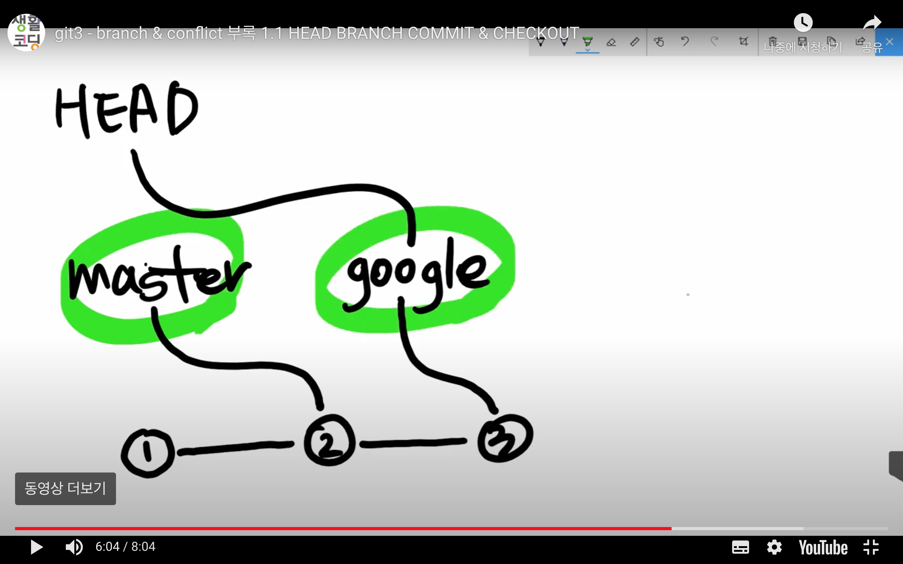

Git Branch
===

## **브랜치**
### : 특정 시점의 커밋(Base)부터 분기하여 관리하는 버전들의 갈래 
### : 공통적인 작업을 하다가, 새로운 시도를 해보거나, 다양한 버전을 만들어볼 필요가 있을 때, 여러 브랜치를 만들어서 관리한다.

  

## **브랜치 확인 : branch**
### : 현재 생성되어 있는 브랜치 목록 확인
> `git branch`

  

## **브랜치 생성 : branch**
### : 현재 커밋(버전)부터 브랜치 생성
> `git branch 브랜치명`

  

## **브랜치 전환 : checkout**
### : HEAD가 가르키는 현재의 작업 커밋 ID를 다른 브랜치로 변경한다.
### : 브랜치가 전환되면, Working Tree 도 해당 브랜치 환경으로 전환된다.
> `git checkout 브랜치명`

  

## **브랜치 병합 : merge**
### Git은 여러 브랜치들을 자동으로 병합해준다.
### 병합하는 커밋(merge commit)이 수행되면, HEAD도 merge commit의 커밋ID를 가르키게 된다.

 

### **# 전환 순서**
### 1 step : 기본 브랜치로 전환
> `git checkout master`

### 2 step : 브랜치 병합 (현재 브랜치에서 병합할 브랜치를 땡겨서 병합)
> `git merge 병합할브랜치`

##### 병합하는 merge commit에 대한 커밋 메시지 작성 필요.

 

### **# 병합 케이스**
### 1. 다른 파일 병합 : Git이 자동으로 병합해줌
### 2. 같은 파일의 다른 위치 수정 후, 병합 : Git이 자동으로 병합해줌
### 3. **같은 파일의 같은 위치 수정 후, 병합** : 충돌(CONFLICT) 발생
1. 충돌난 파일 열기: 충돌난 부분이 표시됨
2. 직접 파일 수정
3. 스테이징 등록: `git add 파일명`
4. 커밋: `git commit`  
   ###### 자동으로 충돌을 해결하고 머지한다는 커밋메시지가 작성되어 있음

  

## **충돌과 3-way merge**
### : 특정 분기점에서 시작한 두개의 브랜치를 병합할 경우,
### 1. 분기점(base)에서의 상태
### 2. 첫번째 브랜치의 상태
### 3. 두번째 브랜치의 상태
### 를 비교하여, base 기준으로 수정된 내용을 우선으로 병합한다.
### 만약 브랜치 두개가 둘다 같은 부분을 수정한 경우에만 Conflict 발생 => 수동 수정 필요

  

## **HEAD, Branch, commit, checkout, reset에 대하여**
### Repository를 만들면, HEAD와 Master브랜치가 생성된다.
### .git 폴더에 HEAD라는 파일이 있으며, MASTER를 가르키도록(checkout) 되어 있다.
### 기본적으로 commit을 하면, Master 브랜치 위에서 버전을 만들어 가는 것이다.
### HEAD --> Master브랜치 --> 1째 커밋ID
### 두번째 커밋을 하면,
### HEAD --> Master브랜치 --> 2째 커밋ID
### 이 되고, 2번째 커밋ID는 1번째 커밋ID를 부모로 가르킨다.
### 브랜치를 만들면,
### HEAD --> Master브랜치 --> 2째 커밋ID 을 보고, 2번째 커밋ID를 base로 브랜치를 생성한다.
### checkout 명령어는 HEAD가 가르키는 값을 변경하는 것
### checkout new브랜치 실행하면, Master브랜치를 가르키던 HEAD가 new브랜치를 가르키게 된다.
### HEAD --> new브랜치 --> 2번째 커밋ID
### new 브랜치에서 새로 commit을 하면, 새로운 커밋ID가 만들어진다.
### HEAD --> new브랜치 --> 3번째 커밋 ID

